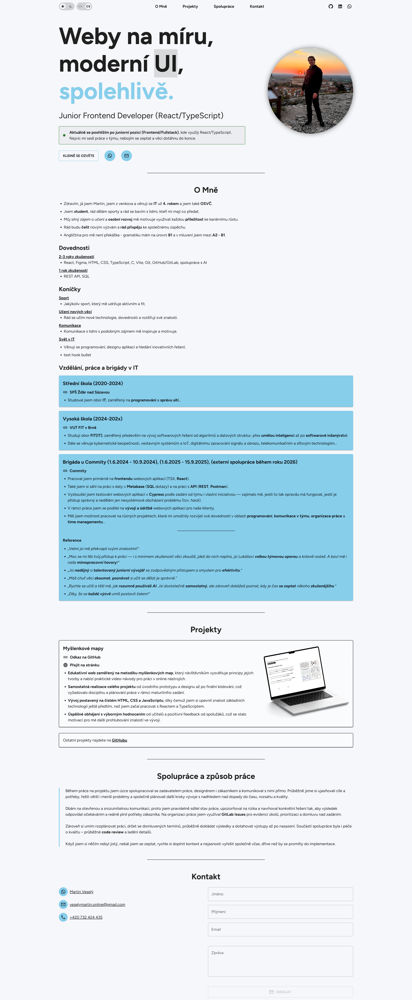

# Portfolio Web

Tohle je moje osobní portfolio a online životopis — jsem Martin Veselý a tenhle
projekt jsem si sám navrhl, naprogramoval a udržuji jako vlastní vizitku pro uchazeče
o práci v IT. Je to responzivní jednostránková webová aplikace s přepínáním světlého
a tmavého režimu, obsahem přizpůsobeným podle role (frontend / backend / support)
a automaticky generovaným CV ve formátu PDF.

- 🌐 **Web:** [martinvesely.netlify.app](https://martinvesely.netlify.app)
- 🎨 **Figma design:** [Portfolio (Figma)](https://www.figma.com/design/zznqhRm0Dif7eVXfq5EVW1/Portfolio?node-id=0-1&t=ZSddmSVTUA5sR8mt-1)
- 💼 **LinkedIn:** [linkedin.com/in/veselymartin-online](https://www.linkedin.com/in/veselymartin-online/)
- ✉️ **Kontakt:** [veselymartin.online@gmail.com](mailto:veselymartin.online@gmail.com)

## O projektu

Web mi slouží zároveň jako portfolio i jako živé CV — obsah (o mně, zkušenosti,
projekty, dovednosti) držím v jednom zdroji (`src/content`, `src/data`) a promítá se
jak do webu, tak do vygenerovaného PDF životopisu (viz [Životopis (CV)](#životopis-cv)
níže). Web i CV tak vždy zobrazují stejné informace, jen v jiném formátu, a přizpůsobují
obsah podle role, o kterou se zrovna hlásím (`?role=frontend|backend|support`).



## Technologie

### Frontend

| Oblast             | Technologie                                                           |
| ------------------ | --------------------------------------------------------------------- |
| Framework          | [React](https://react.dev/)                                           |
| Jazyk              | [TypeScript](https://www.typescriptlang.org/)                         |
| Build & dev server | [Vite](https://vite.dev/)                                             |
| UI                 | [MUI (Material UI)](https://mui.com/), [Emotion](https://emotion.sh/) |
| Ikony              | [MUI Icons](https://mui.com/material-ui/material-icons/)              |
| Obsah (markdown)   | [mui-markdown](https://github.com/HPouyanmehr/mui-markdown)           |
| Font               | [Figtree](https://fonts.google.com/specimen/Figtree) (Google Fonts)   |

### Nástroje a kvalita kódu

- **pnpm** — správa balíčků
- **ESLint** + **typescript-eslint** — lint
- **Prettier** — formátování
- **Playwright** — všechny testy (SEO, přístupnost, kontaktní formulář, jazyk, obrázky)
- **Husky** — git hooky (pre-commit / pre-push, včetně testů před pushnutím)
- **GitHub Actions** — CI (`format:check`, `lint`, `test`, `cv:check`)

### Nasazení a backend

- **Netlify** — hosting
- **Netlify Functions** + **Nodemailer** — odeslání kontaktního formuláře

## Struktura kódu: styly, konstanty a texty

Komponenty v sobě nedrží „magická čísla“ ani napevno zapsané texty. Každá sdílená nebo
významová hodnota má jedno místo, odkud se importuje:

```
src/
├── theme/
│   ├── tokens.ts        # design tokeny: barvy (light/dark), font, tloušťky písma, radiusy,
│   │                    # velikost dotykové plochy, focus outline, hover scale, efekty, rozměry přepínačů
│   ├── sharedStyles.ts  # opakované sx kousky: bold, linkRow, interactiveScale, bulletList,
│   │                    # visuallyHidden, getContrastColor
│   └── theme.ts         # MUI téma (createAppTheme) sestavené z tokenů
├── constants/
│   ├── sections.ts      # id sekcí (#about, #projects…), sectionHref(), sectionHeadingId()
│   ├── headerRole.ts    # název query parametru ?role= a výchozí role
│   ├── preferences.ts   # klíče localStorage, výchozí jazyk a motiv
│   ├── env.ts           # IS_OPEN_TO_WORK z .env
│   ├── contactForm.ts   # název Netlify formuláře, validace (min. délka zprávy, regex e-mailu)
│   └── links.ts         # EXTERNAL_LINK_PROPS (target="_blank" + rel)
├── data/
│   ├── *Content.ts      # obsah sekcí (cs / en)
│   ├── aboutMeMarkdown.ts # markdown sekce O mně (src/content/about-me.*.md)
│   ├── contactFormText.ts
│   └── uiText.ts        # drobné texty rozhraní: aria labely, skip link, navigace, uvozovky
└── index.css            # jen to, co musí být čisté CSS: proměnné --font-family-base,
                         # --mobile-navbar-offset a scroll-margin sekcí
```

Pravidla:

- **Hodnota se opakuje nebo patří k vizuálnímu stylu** (barva, font, hover efekt, focus) →
  `src/theme/tokens.ts`, případně hotový kousek v `sharedStyles.ts`.
- **Hodnota se týká jen jedné komponenty** (např. šířka fotky v hlavičce) → zůstává v lokálním
  objektu `styles` na začátku souboru komponenty.
- **Text viditelný uživateli nebo čtečkou obrazovky** → `src/data/` (vždy `cs` i `en`).
  Komponenty neobsahují žádný obsah ani texty, ani markdown importy: jen je načtou z `src/data/`
  podle aktuálního jazyka a vykreslí.
- Čísla ve spacing vlastnostech `sx` (`p: 2`) jsou jednotky MUI (1 = 8 px), řetězce (`'10px'`)
  jsou doslovné CSS.
- Při přejmenování id sekce uprav i selektor v `index.css`, při změně názvu formuláře
  i skrytý `<form>` v `index.html`.

### Komponenty

Každá velká sekce stránky má hlavní soubor v `src/components/`, který jen načte data podle
jazyka a poskládá podkomponenty ze své složky:

```
src/components/
├── common/
│   └── PageSection.tsx       # <section>/<footer> s id a nadpisem <h2> (sdílí všechny sekce)
├── Header.tsx                # → header/: EyebrowPill, HeroTitle, AvailabilityCard, HeaderCta, HeroPhoto
├── AboutMe.tsx               # → aboutMe/: AboutMeIntro, AboutMeDetails, EducationSection,
│                             #   EducationCard, EducationLink, EducationReferences
├── Projects.tsx              # → projects/: ProjectCard, ProjectLink, MoreProjectsCta
├── WorkApproach.tsx
├── Footer.tsx                # → footer/: ContactList, ContactForm, ContactField
├── Navbar.tsx                # → navbar/: přepínače, odkazy, sociální sítě, mobilní drawer
└── SkipLink.tsx
```

- Podkomponenta dostává obsah přes props, nebo si drobné UI texty (`UI_TEXT`) načte sama přes
  `useLanguage()`. Nikdy neobsahuje text napevno.
- Pomocná logika a typy sekce leží vedle komponent (např. `aboutMe/education.ts`,
  `aboutMe/splitIntroFromMarkdown.ts`), styly sdílené jen v rámci sekce v `<sekce>/styles.ts`.
- Obrázky z `src/assets/` se v podsložkách načítají přes `new URL('../../assets/…', import.meta.url)`.

## Spuštění lokálně

Požadavky: Node.js (viz `.nvmrc`), [pnpm](https://pnpm.io/).

```bash
pnpm install
pnpm dev
```

Další příkazy:

```bash
pnpm build      # produkční build
pnpm preview    # náhled buildu
pnpm lint
pnpm format
pnpm test       # spustí testy (Playwright)
pnpm test:ui    # testy v Playwright UI módu
pnpm cv         # vygeneruje CV-FE/BE/SUPP a exportuje PDF
```

### Životopis (CV)

Obsah se skládá ze stejných zdrojů jako web (`about-me.md`, `work-approach.md`, data v `src/data/`). Hlavička a profil odpovídají parametru `?role=` na webu (`frontend`, `backend`, `support`).

| Soubor    | Role na webu     | Pozice                    |
| --------- | ---------------- | ------------------------- |
| `CV-FE`   | `?role=frontend` | Junior Frontend Developer |
| `CV-BE`   | `?role=backend`  | Junior Software Tester    |
| `CV-SUPP` | `?role=support`  | Junior IT Support         |

Sekce **Dovednosti** a **Koníčky** se z `aboutMeContent.ts` neberou — už jsou v `about-me.md` (stejně jako na stránce O mně).

```bash
pnpm cv:generate  # CV-FE.md, CV-BE.md, CV-SUPP.md
pnpm cv:pdf       # odpovídající PDF (vyžaduje pandoc)
pnpm cv:check     # ověří, že CV.md odpovídá obsahu webu
pnpm cv           # obojí
```

Po změně obsahu webu je potřeba spustit `pnpm cv` a commitnout i aktualizované `CV-*.md`. Jinak `pre-commit` / `pre-push` a CI selžou (`cv:check`).
